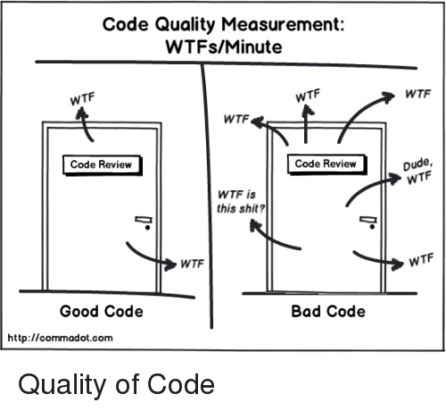
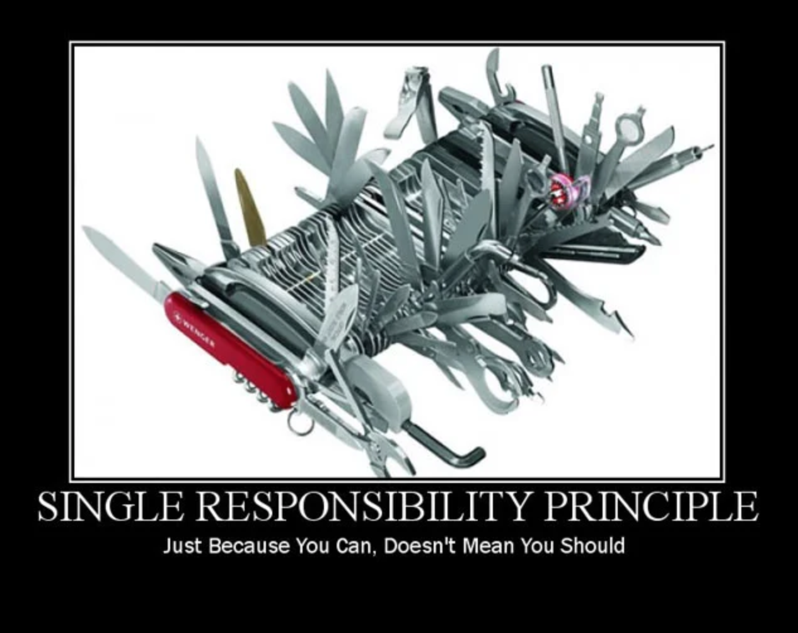

# Упражнение №13 - Pro Tips Pt. 2 (OOD - Object-Oriented Design)

## Какво са [Design Patterns](https://refactoring.guru/design-patterns/cpp)? (Creational, Structural, Behavioral)

* [Singleton](https://refactoring.guru/design-patterns/singleton/cpp/example#example-0) (and [101 ways](https://stackoverflow.com/questions/1008019/c-singleton-design-pattern/1008086#1008086) to make one in C++)

* [Factory](https://refactoring.guru/design-patterns/factory-method) (you already did this in homework 1)
    * [Abstract factory](https://refactoring.guru/design-patterns/abstract-factory) (more abstraction = more possibilities)

* [Prototype](https://refactoring.guru/design-patterns/prototype) (we already did this)

* [Builder](https://refactoring.guru/design-patterns/builder)

* [Adapter](https://refactoring.guru/design-patterns/adapter)

* [Decorator / Wrapper](https://refactoring.guru/design-patterns/decorator)

* [Facade](https://refactoring.guru/design-patterns/facade)

* [Observer / Publish-Subscribe](https://refactoring.guru/design-patterns/observer)

* [State](https://refactoring.guru/design-patterns/state)

... and many more!

## Какво е качество на кода?

## Как се измерва качество на кода?

## Как се следи за качеството?

## Какво е `KISS`?

~~[това](notkiss.jpg)~~

Keep It Simple, Stupid.

## Какво е `DRY`?

~~[това](notdry.jpg)~~

Don't Repeat Yourself.

## Какво е `SOLID`?

~~[това](notsolid.jpeg)~~

1. **S**ingle Responsibility

*A class should have only one reason to change.*

2. **O**pen/Closed

*Software entities should be open for extension, but closed for modification.*

3. **L**iskov Substitution

*If `S` is a subtype of `T`, then objects of type `T` in a program may be replaced with objects of type `S` without altering any of the desirable properties of that program (e.g. correctness).*

4. **I**nterface Segregation

*No client should be forced to depend on methods it does not use.*

5. **D**ependency Inversion

    1. *High-level modules should not depend on low-level modules. Both should depend on abstractions (e.g. interfaces).*
    2. *Abstractions should not depend on details. Details (concrete implementations) should depend on abstractions.*

Полезни статийки:
* https://medium.com/tunaiku-tech/s-o-l-i-d-principles-simplified-explanation-example-f7268ca75758
* https://platis.solutions/blog/2020/06/22/how-to-write-solid-cpp/
* https://itnext.io/solid-principles-explanation-and-examples-715b975dcad4

### Защо ни трябва `SOLID`?
* За да може лесно да се добавят нови функционалности
* За да може всеки нов член на екипа да се ориентира максимално бързо
* За да сведем спагети кода до минимум

### Кога ни трябва `SOLID`?

ВИНАГИ когато пишем ООП код. (трябва само да внимаваме да не overengineer-нем някоя по-проста задачка)

